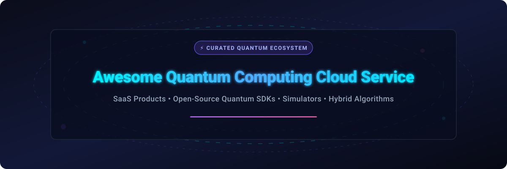

# Awesome Quantum Computing Cloud Service ⚛️☁️

  

  
  
  
  
  
  

---

## 🚀 Top Quantum Computing Cloud Service Ecosystem

**Curated List of Commercial QaaS (Quantum-as-a-Service) Products & Open-Source Software (OSS) SDKs**  
*Focused on Quantum Cloud Access, Hybrid Quantum-Classical Algorithms & Open-Source Quantum Simulators*  

🗓️ **Last updated: October 2026**

---

### 💡 Overview & SEO Keywords
This repository tracks notable **commercial quantum computing cloud services**, **Quantum-as-a-Service (QaaS)** platforms, and **open-source quantum software frameworks** that provide access to quantum processing units (QPUs), noisy intermediate-scale quantum (NISQ) systems, fault-tolerant simulators, and hybrid compilation stacks.

Key topics covered: `Quantum Computing Cloud Service`, `QaaS`, `Quantum SDK`, `Quantum Simulators`, `Qiskit`, `Cirq`, `PennyLane`, `Quantum Machine Learning (QML)`, `Quantum Annealing`, `Trapped-Ion QPU`, `Neutral-Atom Quantum Computing`, `Photonic Quantum Computers`.

- ⚡ **Commercial SaaS Examples**: Amazon Braket, IBM Quantum Platform, Microsoft Azure Quantum, Rigetti Computing, D-Wave Leap, IonQ Quantum Cloud, QuEra Computing, Strangeworks, Xanadu PennyLane Cloud, and QC Ware Forge.
- 🔬 **Open-Source Leadership**: Open-source SDKs lead quantum software development. Frameworks like **Cirq**, **Qiskit**, **PennyLane**, **QuTiP**, **OpenFermion**, **CUDA-Q**, and **Q#** provide the foundation for quantum circuit construction, chemistry simulations, and GPU-accelerated quantum research.

---

## 📑 Table of Contents

- [☁️ SaaS/Hosted Platforms](#%EF%B8%8F-saashosted-platforms)
- [🛠️ Open-Source GitHub Projects](#%EF%B8%8F-open-source-github-projects)
- [🤝 How to Contribute](#-how-to-contribute)
- [📜 Disclaimer](#-disclaimer)
- [💖 Support & Sponsorship](#-support--sponsorship)
- [⭐ Star History](#-star-history)

---

## ☁️ SaaS/Hosted Platforms

> 📈 **Sector Overview:** The global quantum computing cloud service market is estimated at **$1.1B–$1.6B in 2026** (projected to reach **$6.2B+ by 2030** at ~35% CAGR). The sector is **highly fragmented** due to competing qubit hardware modalities (superconducting, trapped-ion, neutral-atom, photonic, annealing) and a dual model where hyperscale aggregators (AWS, Azure) distribute specialized pure-play quantum hardware backends.

| 🏢 Platform | 💰 Company Size (Valuation/Revenue) | 📝 Description | 🏷️ Pricing | 🎁 Free Tier Limit |
| :--- | :--- | :--- | :--- | :--- |
| **[Microsoft Azure Quantum](https://azure.microsoft.com/en-us/products/quantum)** | Market Cap: ~$3.10 Trillion (Rev: ~$245B) | Microsoft's cloud quantum service — access to IonQ, Quantinuum, Rigetti, Pasqal. Q# programming language, Resource Estimator & Copilot integration. | $0.30/task + $0.00035–$0.01/shot (QPU); $10.00/hour (quantum simulator execution) | $500 free credit per provider for new users; unlimited free cloud simulator & Quantinuum Emulator without Azure account |
| **[Amazon Braket](https://aws.amazon.com/braket/)** | Market Cap: ~$2.10 Trillion (AWS Rev: ~$90B) | AWS fully managed quantum service — access to IonQ, Rigetti, QuEra, and D-Wave. Unified Python SDK, 11 pre-built algorithms & Braket Direct. | $0.30/task + $0.00035–$0.01/shot (QPU); $0.075/min (SV1 simulator execution) | 1 hour per month of managed simulator execution (SV1/TN1/DM1) free for first 12 months |
| **[IBM Quantum Platform](https://quantum.ibm.com/)** | Market Cap: ~$200.00 Billion (Rev: ~$62B) | Longest-running quantum cloud service (since 2016) with Heron QPU access. Data locality options, SSO integration, and native Qiskit SDK support. | $1.60 per QPU second (Pay-as-you-go Plan); $800/month minimum for Premium tier | 10 minutes of QPU time per month free forever on 127-qubit / Heron quantum processors (Open Plan) |
| **[IonQ Quantum Cloud](https://ionq.com/)** | Market Cap: ~$2.20 Billion (Rev: ~$35M) | Trapped-ion quantum computers with industry-leading gate fidelity. Quantum Cloud Console for job management, API access & multi-cloud SDK integration. | $0.30/task + $0.01/shot (Aria/Forte QPU); $100.00/hour reserved QPU access | $500 free Azure/AWS partner credit allocation; 100 free simulator credits on account signup |
| **[Xanadu PennyLane Cloud](https://www.xanadu.ai/)** | Valuation: ~$1.00 Billion (Private Unicorn) | Photonic quantum computing cloud access featuring Aurora scalable hardware with real-time error correction and PennyLane QML framework. | $0.0005 per shot (X-series photonic QPU); $10.00/hour cloud simulator execution | Free access to PennyLane ecosystem with 2 hours/month cloud simulator time & 10 free photonic QPU jobs on signup |
| **[Rigetti Computing](https://www.rigetti.com/)** | Market Cap: ~$350.00 Million (Rev: ~$13M) | Cloud access to Rigetti superconducting quantum processors with hybrid classical-quantum co-processing using Quil language & Forest SDK. | $0.30/task + $0.00035/shot (QPU via Braket/Azure); $900.00/hour dedicated QPU reservation | 10 minutes free QPU testing on Rigetti Novera QPU via partner trial; $500 AWS/Azure partner credits |
| **[QuEra Computing](https://www.quera.com/)** | Valuation: ~$300.00 Million (Private VC) | Neutral-atom quantum computers featuring Aquila (256 qubits with analog control) available via Amazon Braket and Azure Quantum. | $0.30/task + $0.01/shot (QPU execution via Braket/Azure); $2,250.00/hour reserved QPU time | $500 AWS Braket credit allocation for research users; 1 hour free analog simulation trial |
| **[D-Wave Leap](https://www.dwavequantum.com/solutions-and-products/cloud-platform/)** | Market Cap: ~$250.00 Million (Rev: ~$10M) | Commercial quantum annealing cloud service with 99.9% uptime. Access to Advantage2 annealing systems & hybrid solvers for up to 2M variables. | $0.35 per QPU second (Pay-as-you-go); $2,000/month Developer subscription (15 QPU sec/month) | 1 minute (60 seconds) of QPU time per month free on sign-up (up to 20 minutes if GitHub account linked) |
| **[Strangeworks](https://strangeworks.com/)** | Valuation: ~$120.00 Million (Private VC) | Unified compute platform aggregating quantum, quantum-inspired, HPC, and classical backends with one-click setup and zero markup. | $0.001 per shot (zero markup on cloud QPU execution); $500.00/month enterprise workspace subscription | Free Community tier with unlimited public workspace access & 100 free simulator jobs/month |
| **[QC Ware Forge](https://qcware.com/)** | Valuation: ~$100.00 Million (Private VC) | Enterprise quantum computing platform featuring specialized turnkey algorithms for quantum chemistry, optimization, and machine learning. | $50.00/hour hybrid algorithm solver usage; $2,500.00/month Starter subscription | 30-day free trial with 1,000 Forge credit units for chemistry & optimization solver testing |

---

## 🛠️ Open-Source GitHub Projects

*Sorted by GitHub Stars_Count (Descending)*

1. **[Cirq](https://github.com/quantumlib/Cirq)**   
   **Google's open-source quantum computing framework**, Apache-2.0 licensed. Designed for NISQ-era algorithms with precise control over quantum circuits, noise models, and pulse control. Native support for Google Sycamore and Willow processors.

2. **[Qiskit](https://github.com/Qiskit/qiskit)**   
   **IBM's foundational open-source quantum SDK**, Apache-2.0 licensed. The de facto standard for building, compiling, and executing quantum circuits on IBM Quantum hardware and high-performance simulators (Aer).

3. **[PennyLane](https://github.com/PennyLaneAI/pennylane)**   
   **Xanadu's leading open-source quantum machine learning framework**, Apache-2.0 licensed. Differentiable quantum programming integrating with PyTorch, TensorFlow, and JAX for hardware-agnostic hybrid quantum-classical optimization.

4. **[QuTiP](https://github.com/qutip/qutip)**   
   **Quantum Toolbox in Python**, BSD-3-Clause licensed. The industry standard framework for simulating open quantum systems, master equations, quantum optics, and quantum dynamics.

5. **[OpenFermion](https://github.com/quantumlib/OpenFermion)**   
   **Google's open-source quantum chemistry package**, Apache-2.0 licensed. Translates electronic structure calculations, molecular Hamiltonians, and fermionic operators into qubit circuits.

6. **[Q# (Microsoft Quantum Development Kit)](https://github.com/microsoft/qsharp)**   
   **Microsoft's quantum domain-specific language and QDK**, MIT licensed. Features a high-performance Rust-based compiler, hardware-agnostic execution, and resource estimation tools for Azure Quantum.

7. **[CUDA-Q](https://github.com/NVIDIA/cuda-quantum)**   
   **NVIDIA's GPU-accelerated quantum programming platform**, Apache-2.0 licensed. Delivers unified hybrid CPU-GPU-QPU compilation for fault-tolerant quantum computing and quantum error correction.

8. **[Strawberry Fields](https://github.com/XanaduAI/strawberryfields)**   
   **Xanadu's open-source library for continuous-variable photonic quantum computing**, Apache-2.0 licensed. Powered by the Blackbird programming language for optical quantum hardware simulation.

9. **[ProjectQ](https://github.com/ProjectQ-Framework/ProjectQ)**   
   **Open-source quantum compiler framework from ETH Zurich**, Apache-2.0 licensed. Modular architecture that separates high-level quantum algorithm synthesis from target QPU backend execution.

10. **[Yao.jl](https://github.com/QuantumBFS/Yao.jl)**   
    **Julia-based extensible quantum algorithm framework**, MIT licensed. Designed for research in quantum dynamics, intermediate circuit representation, and high-speed Julia simulation.

11. **[Pulser](https://github.com/pasqal-io/Pulser)**   
    **Pasqal's open-source Python library for neutral-atom quantum computing**, Apache-2.0 licensed. Enables pulse-level sequence generation and simulation for neutral atom arrays.

12. **[Catalyst](https://github.com/PennyLaneAI/catalyst)**   
    **JIT compiler for hybrid quantum programs in PennyLane**, Apache-2.0 licensed. Built on MLIR to optimize hybrid quantum-classical execution workflows.

13. **[Quantum++ (qpp)](https://github.com/softwareQinc/qpp)**   
    **Modern C++11 quantum computing library**, MIT licensed. Template-based header-only C++ library for low-overhead, high-speed quantum state and gate manipulation.

14. **[PyQtorch](https://github.com/PyQtorch/PyQtorch)**   
    **PyTorch-based differentiable quantum circuit simulator**, Apache-2.0 licensed. Optimized for deep quantum neural networks and backpropagation through quantum state vectors.

15. **[sQUlearn](https://github.com/sqor/sQUlearn)**   
    **Scikit-learn compliant quantum machine learning library**, BSD-3-Clause licensed. Provides seamless integration of quantum kernel methods and quantum neural networks for data scientists.

16. **[Tweedledum](https://github.com/boschmitt/tweedledum)**   
    **C++17 library for quantum circuit analysis, compilation, and synthesis**, MIT licensed. Focuses on reversible logic synthesis and circuit layout optimization.

---

## 🤝 How to Contribute

1. 🍴 **Fork** this repository.
2. 📝 **Add or update** entries in `README.md` (ensure formatting adheres to existing table and list structures).
3. 🔍 Include provider/project name, official documentation link, concise description, pricing/free tier parameters, and Stars_Badges where applicable.
4. 📬 Submit a **Pull Request (PR)** with a clear commit description.

Check out the master repository collection at [Awesome-Awesome-Awesome](https://github.com/ishandutta2007/Awesome-Awesome-Awesome)!

---

## 📜 Disclaimer

- This is a **community-curated list** for informational and educational purposes.
- Quantum computing hardware is rapidly evolving; qubit counts, fidelity metrics, pricing schedules, and cloud access availability are subject to vendor updates.
- Always verify current resource pricing on official cloud provider portals before dispatching high-shot QPU workloads.

---

## 💖 Support & Sponsorship

If you find this repository valuable for your research, enterprise evaluation, or quantum development journey:

- ⭐ **Star** this repository on GitHub to boost visibility!
- 🔀 **Fork** it to keep your own curated reference.
- 📣 **Share** with fellow quantum researchers, developers, and colleagues.
- ☕ **Sponsor the Maintainer**: Support ongoing open-source curation via [GitHub Sponsors](https://github.com/sponsors/ishandutta2007).

---

## ⭐ Star History

---

  <b>Made with ❤️ for quantum researchers, algorithm developers, and enterprise innovation teams worldwide.</b>

